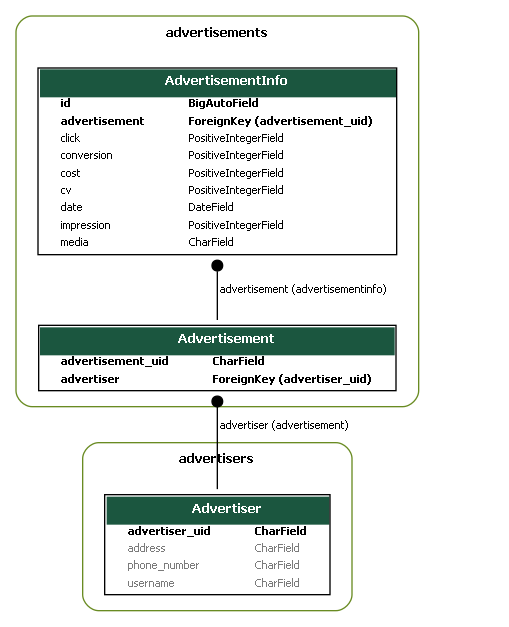
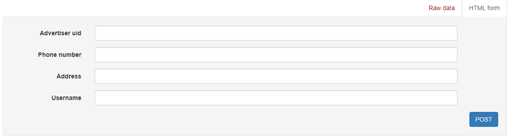
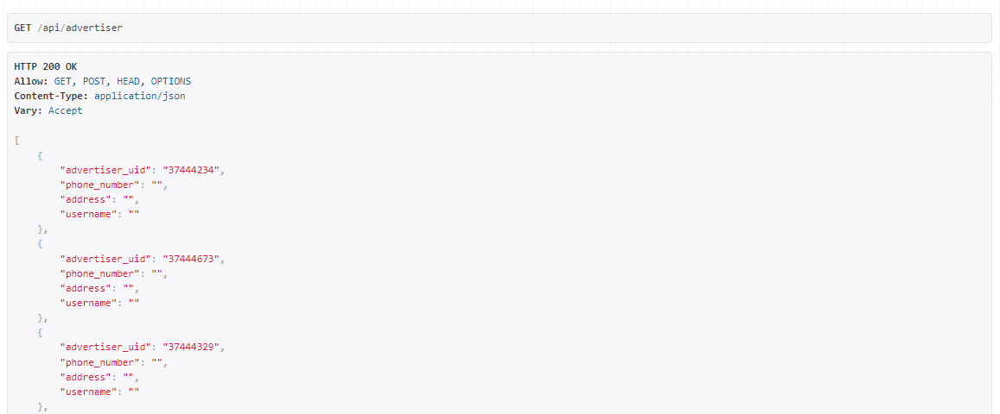
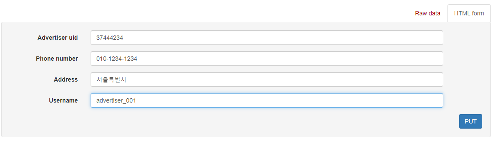
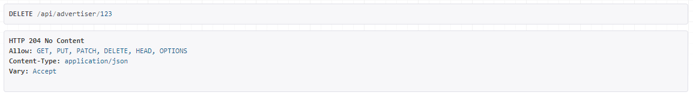
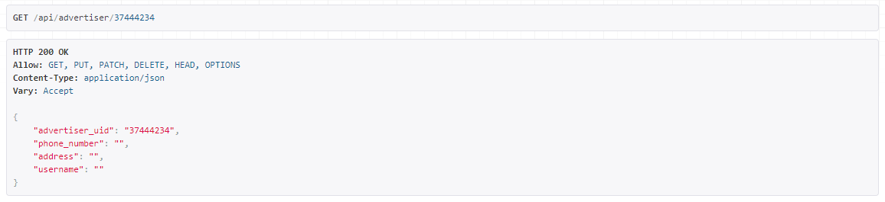
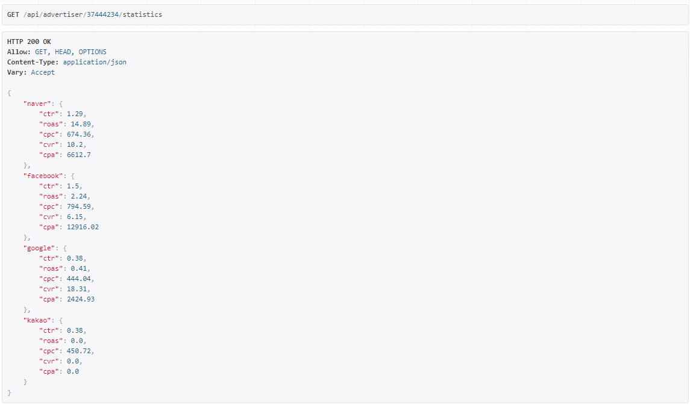
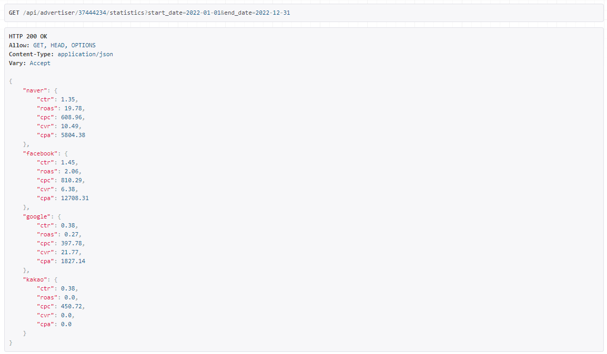

<div align="center"></div>

# Madup_기업과제
원티드 프리온보딩 코스 _ 첫번째 기업과제 _ 매드업

###  배포 주소 [GoTo](http://3.38.168.19/)
### 팀 노션 [GoTo](https://www.notion.so/Madup-0258d97f6b944653b226c0329b7a2af7)
- 요구사항 분석, 정보 공유 및 프로젝트 진행을 위해 사용

## 과제 해석
이 서비스는 csv 파일로 모아진 여러 광고주들의 광고별 데이터를 서버에 한번에 적재하고 통계를 확인할 수 있는 서비스입니다.

## 개발 요구사항
- Database 조건
	- Snack Case 사용한 colunms
	- index 설정
- Server 조건
	- REST API 프레임워크 사용
	- TEST CODE 작성
	- API 기능만 구현
	- RESTful하게 구현(Endpoint URL, HTTP Method)
	- JSON 형식의 Response
	- SQL Alchemy, Peewee, Django ORM, JPA, Hibernate 사용(Raw 사용 불가)
- 가산점 조건
	- 짜임새 있는 폴더, 파일, 코드 구조
	- 데이터 증가에 따라 일정한 응답시간을 가질 수 있도록 구현
	- DB migration tool 사용
		- migration history repository 업로드
	- Dockerize

## 구현 요구사항
- [x] 광고주 CRUD
	- 광고주의 정보를 담을 수 있는 테이블 생성
	- 광고주 등록, 조회, 수정, 삭제
- [x] 광고 정보 검색
	- `광고주 uid`, `date`로 검색할 시 `media`별 `CTR`, `ROAS`, `CPC`, `CVR`, `CPA` 조회
	-	| 컬럼명 | 설명 | 공식 | 단위 |
		| :---: | :---: | :--- | :---: |
		| CTR | 광고 노출 대비 클릭률 | click *100/impression | 백분율, 소숫점 둘째자리 |
		| ROAS | 광고 비용 대비 매출액 | cv*100/cost | 백분율, 소숫점 둘째자리 |
		| CPC | 클릭당 광고비 | cost/click | 소숫점 둘째자리 |
		| CVR | 클릭 대비 전환율 | cost/click | 백분율, 소숫점 둘째자리 |
		| CPA | 전환 당 광고비 | cost/conversion | 소숫점 둘째자리 |
	- 출력 예시
		```
			  {
				  "naver" : {
					  "ctr" : 0.51,
					  "cpc" : 990.55,
					  "roas" :265.38,
					  "cvr" : 8.33,
					  "cpa" : 881.01
				  },
				  "facebook" : {
					  "ctr" : 0.51,
					  "cpc" : 990.55,
					  "roas" :265.38,
					  "cvr" : 8.33,
					  "cpa" : 881.01
				  },
				  ...
			  }
		```

## 구현

### 기술 스택
      

### 개발 기간
- 2022.04.27 - 2022.04.29

> ### ERD


> ### 구성 요소
- **광고주(Advertiser)**
	- advertiser_uid : 광고주 고유 id값
	- username : 광고주 이름
	- phone_number : 핸드폰 번호
	- address : 주소
- **광고(Advertisement)**
	- advertise : 광고 고유 id값
	- advertiser : 광고주
- **광고 정보(AdvertisementInfo)**
	- advertisement : 광고
	- media : 광고 매체
	- date : 광고 일자
	- cost : 비용
	- impression : 노출수
	- click : 클릭수
	- conversion : 구매 전환수
	- cv : 구매 전환에 따른 매출액

> ### API 명세
#### advertiser 관련
**광고주 생성** : POST /api/advertiser


- 주소, 이름, 핸드폰 번호를 입력받아 광고주를 생성합니다.

**광고주 조회** : GET /api/advertiser


- 광고주 정보를 조회합니다.

**광고주 정보 수정** : PUT /api/advertiser/:pk


- pk 값에 해당하는 광고주의 정보를 수정합니다.

**광고주 삭제** : DELETE /api/advertiser/:pk


- pk 값에 해당하는 광고주를 삭제합니다.

**광고주 광고 상세 조회** : GET /api/advertiser/:pk


- pk 값에 해당하는 광고주의 광고 정보를 조회합니다.

**광고주 미디어별 광고 통계 조회** : GET /api/advertiser/:pk/statistics


- pk 값에 해당하는 광고주의 미디어별 광고 통계 정보를 조회합니다.

**광고주 미디어별 광고 통계 조회 - 기간 필터링** : GET /api/advertiser/:pk?start_date=yyyy-mm-dd&end_date=yyyy-mm-dd


- pk 값에 해당하는 광고주의 미디어별 광고 통계 정보를 파라미터로 넘어온 기간에 따라 필터링하여 조회합니다.

> ### 구현 과정 중 특이사항
- utils/db_uploader.py를 사용하여 주어진 데이터셋을 database에 바로 저장해 요구사항을 확인, 구현하였습니다.

### Step to run
```
$ python -m venv venv
$ source venv/Scripts/activate
$ python install -r requirements.txt
$ python manage.py runserver --settings=config.settings.develop
```

## Author
### 김채욱
* Test Code
    - advertiser api HTTP Method 별로 테스트 진행
    - Model 부분은 facotry boy와 faker를 이용해 테스트
    - pytest.ini설정 및 conftest 파일에 전체 함수 정의
### 이형준
* 모델링
* advertiser API
  * CRUD MODELViewset으로 구현
  * 통계 api
    * 검색 구현
    * aggregate를 이용한 통계 데이터 구현
* 배포
  * docker(nginx, project 컨테이너) 이용
  * aws ec2를 이용
### 강정희
- 프로젝트 요구사항 분석
- 초기 모델링
    - 주어진 광고 csv 데이터를 분석해 데이터베이스 설계
- 주어진 광고 csv 데이터 database uploader 구현
- advertisement API 예외 처리 구현
    - 요청된 형식에 맞는 광고 정보가 검색되지 않을 경우 400 code 리턴
- 문서화
    - README.md 작성